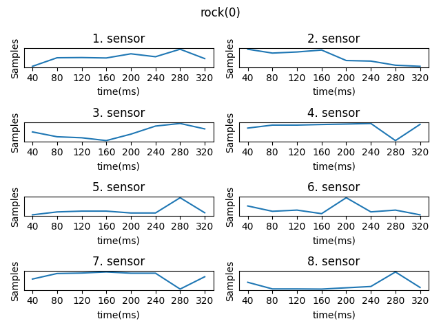
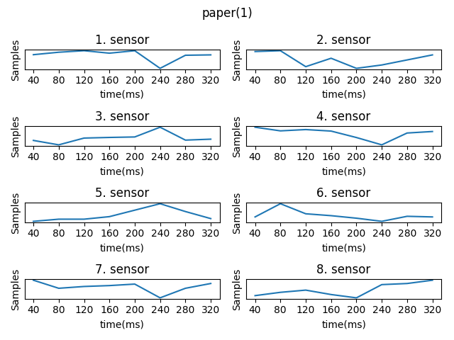
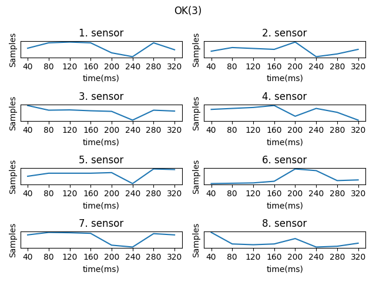

# HandGestureRecognition   

## Introduction:   
Bionic prosthetic hands are rapidly evolving. An in-depth knowledge of this field of medicine is currently only required by a small number of individuals working in highly specialist units. However, with improving technology it is likely that the demand for and application of bionic hands will continue to increase and a wider understanding will be necessary.[1]    
In this project, we have used EMG signals collected to predict hand gestures where they are rock, paper, scissors and OK sign.  
Project, specifically build for comparing two different machine learning methods on sequential record of sensors data where the methods are Random Forest and LSTM.  

## Material:   
This dataset consists of four classes of motion were written from MYO armband with the help of an app provided and collected by: https://github.com/cyber-punk-me/nukleos . The MYO armband has 8 sensors placed on skin surface, each measures electrical activity produced by muscles beneath. 
According to data provider, Each dataset line has 8 sequential readings of all 8 sensors. So there are 64 columns of EMG data where each sample varies from -128 to 127. The last column is a resulting gesture that was made while recording the data (classes 0-3). Also, the data was recorded at 200 Hz, which means that each line is 8*(1/200) seconds = 40ms of record time.[2]
So each line has the following structure:  
| 1.sensors | 2.sensors | 3.sensors | 4.sensors | 5.sensors | 6.sensors | 7.sensors | 8.sensors | GESTURE_CLASS |   
| --------- | --------- | --------- | --------- | --------- | --------- | --------- | --------- | ------------- |  
| 8-sequential data | 8-sequential data | 8-sequential data | 8-sequential data | 8-sequential data | 8-sequential data | 8-sequential data | 8-sequential data | 8-sequential data |  

Gesture classes were : rock - 0, scissors - 1, paper - 2, ok - 3. Rock, paper, scissors gestures are like in the game with the same name, and OK sign is index finger touching the thumb and the rest of the fingers spread. 
Each gesture was recorded 6 times for 20 seconds. Each time recording started with the gesture being already prepared and held. Recording stopped while the gesture was still being held. In total there is 120 seconds of each gesture being held in fixed position. All of them recorded from the same right forearm in a short timespan.[2]
There are 4 different .csv file shared where each of them separated by class and all of 4 files are utilized for this project. Also; Numpy, matplotlib, tensorflow, pandas, sklearn libraries are used. All of the development process carried out in Pycharm IDE with Python version 3.7.    

   

## Method:  
First of all, this project aims to accomplish predicting certain hand gestures by using the muscle activies data collected as EMG signals with a consecutive interval. Methods will be explained below in order:   
  
**1. Importing necessary libraries.**   
Numpy, Matplotlib, Pandas, Sklearn, Tensorflow packages imported.   
**2. Reading all the raw data and concatenating them.**   
Since the .csv files are seperated by classes reading each and concatenating them was the first step.   
**3. Preprocessing for random forest classification.**    
First 64 columns are taken as the input features and 65th column is the class. Input and class data are seperated. Then, data is splitted as %33 test set and %66 percent training set equally for each class.   
**4. Training and predicting for random forest model.**     
Random Forest classifier is build with n_estimators=100 that is number of trees in the forest. Model is fitted for training data and prediction is made for test input data. Finally, accuracy is calculated.   
**5.  Preprocessing for LSTM classification.**   
Input and class data are seperated as numpy array and First 64 columns are taken as the inputs and 65th column is the class. Then, Input array is reshaped to one flatten vector to Standard Scale the data. Scaled data is reshaped as 8x8 matrix for each row so there are 8 sequential data for each sensor/feature. Class array is encoded as one hot so the classes are symbolized as vector of 4 elements where the corresponding index has element of 1 and other three elements are 0. Then, data is splitted as %33 test set and %66 percent training set equally for each class.   
**6. Training and predicting for LSTM.**   
Sequential LSTM model is build with input shape of 8 steps and 8 features. And output layer with 4 units with Softmax as activation method. Model is fitted for training data with epochs=250 and batch_size=32 and predicted for test input data. Since, class array was one hot encoded, prediction and test class arrays are decoded first and finally, accuracy is calculated.   

## Results&Discussion:  

Random Forest classifier given 64 numbers(features) was to predict a gesture class (0-3) had accuracy of 91% which is quite satisfying.   
In another case of using the data was sequentially(8 feature with 8 consecutive data), LSTM has been used to classify (0-3). Resulting accuracy was 95% which proves that the understanding the data and applying correct preprocessing steps is a key point to accomplish a quality built machine learning model. More importantly for the problem definition in this project, utilizing a neural network based model is proved better than a decision based machine learning method.   

   

## References:  

[1] https://www.researchgate.net/publication/51759015_Bionic_prosthetic_hands_A_review_of_present_technology_and_future_aspirations    
[2] https://www.kaggle.com/kyr7plus/emg-4 

#### Notes:
Some of the information about data is directly copied from [2] in case of any copyright please contact me.
